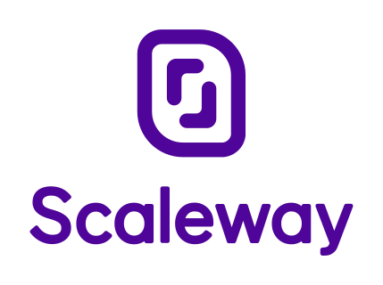

# scaleway-lib

scaleway-lib is a set of NPM packages used at Scaleway.

---

- [Available packages](#available-packages)
- [Development](#development)
  - [Locally](#locally)
  - [Link against another project (with `yalc`) => FAVORED](#link-against-another-project-with-yalc-favored)
  - [Link against another project (with `yarn link`)](#link-against-another-project-with-yarn-link)
  - [Linting](#linting)
  - [Unit Test](#unit-test)
- [Lerna](#lerna)
- [Notes](#notes)
  - [On build targets](#on-build-targets)
  - [On build outputs](#on-build-outputs)
  - [On commits](#on-commits)
  - [On git hooks](#on-git-hooks)
  - [On versioning](#on-versioning)
- [Contributing Guidelines](#contributing-guidelines)

---

## Available packages

- [`@scaleway/countries`](./packages/countries/README.md): ISO 3166/3166-2 coutries JSON database.

  
  
  

- [`@scaleway/eslint-config-react`](./packages/eslint-config-react/README.md): A shared eslint react opiniated configuration.

  
  
  

- [`@scaleway/random-name`](./packages/random-name/README.md): A tiny utility to generate random names.

  
  
  

- [`@scaleway/use-query-params`](./packages/use-query-params/README.md):
 A tiny react hook to read and update URLs query parameters.

  
  
  

- [`@scaleway/regex`](./packages/regex/README.md): usefull regex named.

  
  
  

## Development

### Locally

```bash
$ git clone git@github.com:scaleway/scaleway-lib.git
$ cd scaleway-lib
$ yarn
$ # ... do your changes ...
$ yarn run lint
$ yarn run test
```

### Link against another project (with `yalc`) => FAVORED

> [`yalc`](https://github.com/whitecolor/yalc) is a tool aiming to simplify working with local npm packages by providing a different workflow than `npm/yarn link`, hence avoiding most of their issues with module resolving.

```bash
$ yarn global add yalc # Make sure to have the yalc binary
```

```bash
$ yarn run build # Build the package
$ cd packages/example_package && yalc publish
$ # Now it's ready to install in your project
$ cd ../project-something
$ yalc add @scaleway/package-name --yarn
$ # If you do some changes into your package
$ yarn run build
$ cd packages/example_package && yalc publish --push # --push will automatically update the package on projects where it have been added
```

> :warning: `yalc` create a `yalc.lock` and updates the `package.json` in the target project. Make sure to not commit these changes

### Link against another project (with `yarn link`)

```bash
$ cd packages/example_package && yarn link
$ cd - && yarn run build # rebuild the package
$ # Now it's ready to link into your project
$ cd ../project-something
$ yarn link @scaleway/example_package
```

### Linting

```bash
$ yarn run lint
$ yarn run lint:fix
```

### Unit Test

```bash
$ yarn run test # Will run all tests
$ yarn run test --updateSnapshot # Will update all snapshots
$ yarn run test:watch # Will watch tests and only rerun the one who are modified
$ yarn run test:coverage # Will generate a coverage report
```

## Lerna

This project is managed with [Lerna](https://lerna.js.org). Lerna is a tool to manage multiple NPM packages inside the same repository.

Lerna also allows us to use [Yarn workspaces](https://classic.yarnpkg.com/en/docs/workspaces/) to manage our dependencies. This implies a few things:

- devDependencies should be included in top package.json
- There should be no `node_modules` or `yarn.lock` in sub-packages
- There is a special syntax to manage sub-packages dependencies:

```bash
$ yarn add -W -D new_dependency # Add a new devDependency to root project
$ yarn workspace @scaleway/package_name add new_dependency
$ yarn workspace @scaleway/package_name remove old_dependency
```

## Notes

### On build targets

We target by default Node@14 but you can add a browser output by adding a `browser` (you can find the spec [here](https://github.com/defunctzombie/package-browser-field-spec)) target to your `package.json`.

```js
  "browser": {
    "dist/index.js": "dist/index.browser.js",
    "dist/module.js": "dist/module.browser.js"
  }
```

The browserlist we are currently using is available in the [rollup.config.js](./rollup.config.js)

> :warning: Bear in mind that we do not currently support different entrypoint per target as we don't have the use case

### On build outputs

We output both UMD and ESM files for each target.

### On commits

We enforce the [conventionnal commits](https://www.conventionalcommits.org) convention in order to infer package bump versions and generate changelog.

### On git hooks

We have a [husky](https://github.com/typicode/husky) hook on `pre-commit` and `pre-push` which will ensure the file you committed matches the configured formating (`eslint` + `prettier`)

We also have one on `commit-msg` which will ensure you commit message respects our commit convention

We strongly encourage you not to but you can skip these hooks by passing `--no-verify` to your `git` commands

### On versioning

We follow the [semver](http://semver.org/) semantic.

## Contributing Guidelines

- Ensure tests are still ok and code coverage have not decreased
- Follow linter rules ([tldr](#linting)).
- CI is enforced, you won't be able to merge unless pipeline is successful.
