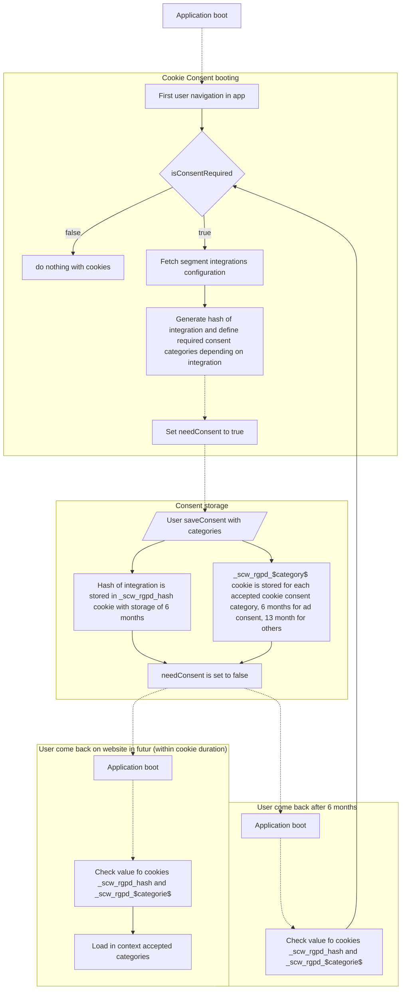

# `@scaleway/cookie-consent`

This package is an helper to handle cookie consents with Segment integrations.
It will handle the cookie consent for each categories.

This package does not contain design element to display a cookie consent modal,
it only handle the storage and the init of cookie consent in a React provider.

## QuickStart

In order to use it, first you need to provide a context at the top level of your application

```tsx
import { PropsWithChildren } from 'react'

const MyApp = ({ children }: PropsWithChildren) => {
  return (
    <CookieConsentProvider
      isConsentRequired // Switch off consents if not defined (usefull for E2E testing)
      essentialIntegrations={[]} // List of mandatory integrations
      config={{
        segment, // Segment configuration used to get dynamically the integration used
      }}
      // not required
      cookiePrefix="_scw_rgpd" // default value
      consentMaxAge={13 * 30 * 24 * 60 * 60} // default value (appx 13 months)
      consentAdvertisingMaxAge={6 * 30 * 24 * 60 * 60} // default value (appx 6 months)
      cookiesOptions={{ sameSite: 'strict', secure: true, path: '/' }} // default value
    >
      {children}
    </CookieConsentProvider>
  )
}
```

Then in your cookie modal component you could simply use exposed hook to get and modify consents

```tsx
export function PanelConsent() {
  const { saveConsent, categoriesConsent } = useCookieConsent()

  const setAllConsents = ({
    categoriesConsent,
    value,
  }: {
    categoriesConsent: Partial<Consent>
    value: boolean
  }) =>
    Object.keys(categoriesConsent).reduce(
      (acc, category) => ({ ...acc, [category]: value }),
      {},
    )

  const handleClick = (consentForAll: boolean) => () => {
    saveConsent(setAllConsents({ categoriesConsent, value: consentForAll }))
  }

  const onAgreeAll = handleClick(true)

  const onReject = handleClick(false)

  return (
    <div className={styles.consent}>
      <div>Do you accept consents ?</div>
      <div>
        <Button onClick={onAgreeAll} autoFocus>
          Accept
        </Button>
        <Button onClick={onReject}>Decline</Button>
      </div>
    </div>
  )
}
```

### Segment Consent Middleware

As it's necessary now to have a consent management.
https://segment.com/docs/privacy/consent-management/configure-consent-management/

you will have the possibility to add the SegmentConsentMiddleware, be aware that there is a dependency with SegmenttProvider.

### User flow



## How to contribute ?

### Prerequisites

```
$ cd packages/cookie-consent
```

### Start

```bash
$ pnpm build # Build the package
$ pnpm watch # Build the package and watch for changes
```
